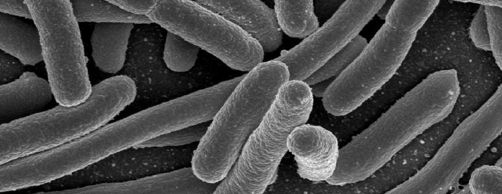
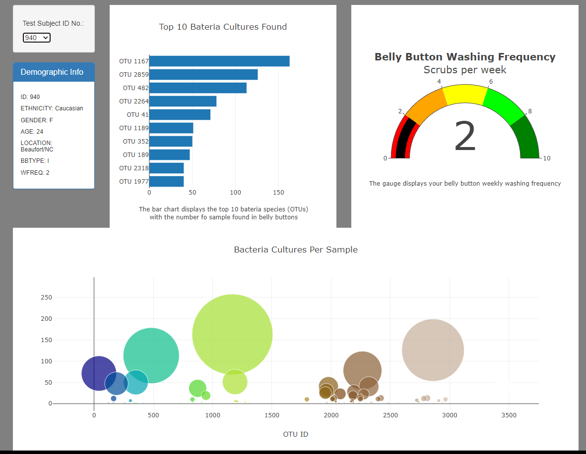
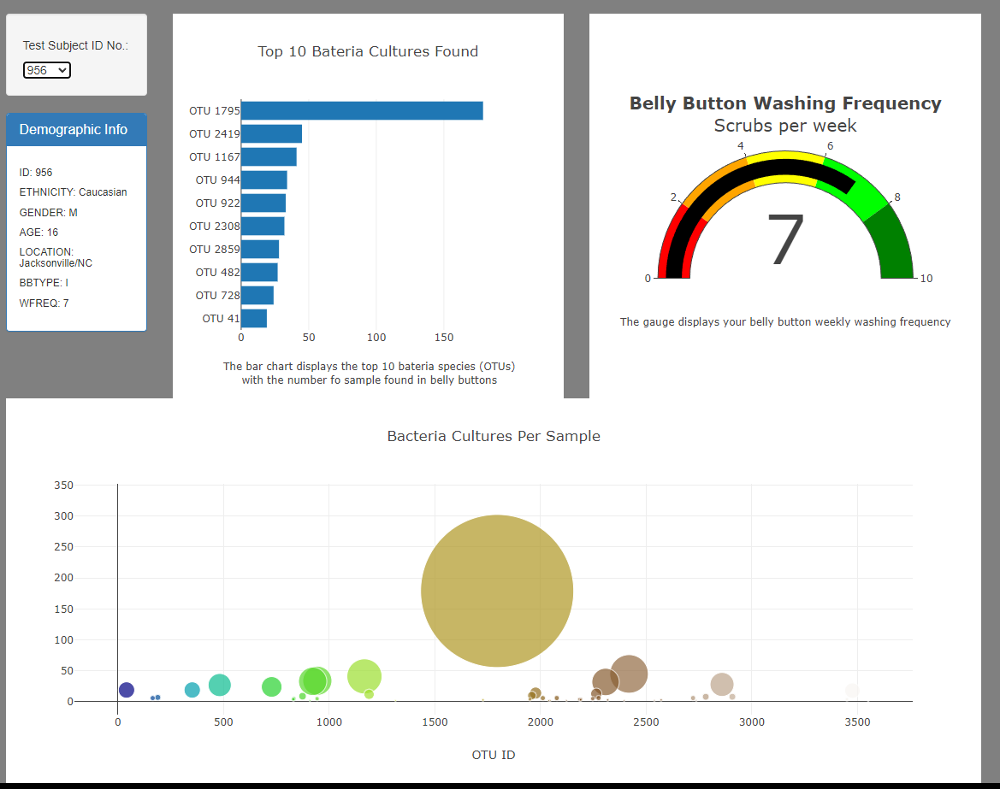

# PlotlyChallenge

This app is being served at: https://salmanrazzaq-94.github.io/BellyButton_Biodiversity_Plotly/

## Purpose

The pupose of this project is to take data samples given to us in a json file about different bacteria samples from peoples belly buttons and putting the information in a html with a bar, bubble, and a gauge chart to better look at the data.

## Results

In the intital image after creating the html and having all the data show up this is what the inital charts will look like:

The next image shows clicking on arrow and hovering over the next sample you want to see next:

This last image shows after selecting another sample and all the relative information for that sample showing the charts:

